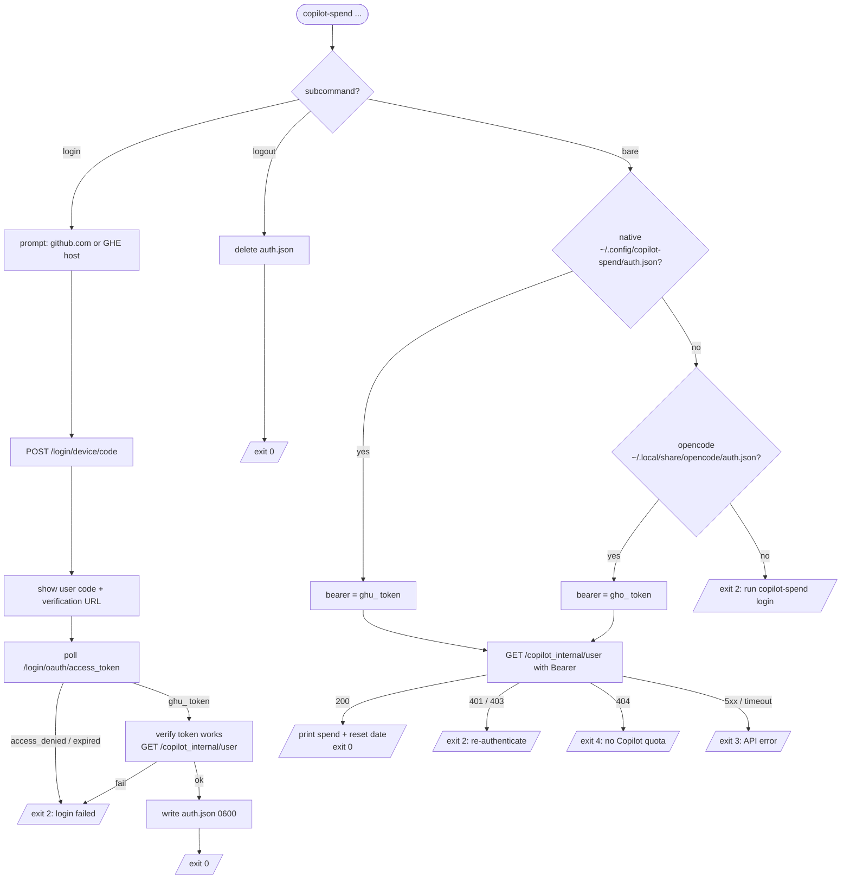

# copilot-spend

Find out what your Copilot habit actually costs.

A small, zero-dependency CLI that reads your GitHub Copilot quota and
prints your current-period billing mode, quota bucket, and reset date.
Works against both `github.com` and GitHub Enterprise hosts.

This is the TypeScript/Node build, published to npm. It is a faithful
port of the [Python package](https://github.com/nkootstra/copilot-spend/tree/main/python)
with identical behavior — same auth sources, same output, same exit
codes, same JSON schema. Built with [Bun](https://bun.sh); the published
artifact is a single bundled file that runs on Node 18+.

## How it works



The bare `copilot-spend` invocation, expanded as numbered steps:

1. Resolves a GitHub Copilot token from the first source that exists, in
   this order:
   1. Native: `~/.config/copilot-spend/auth.json`, created by running
      `copilot-spend login`.
   2. Opencode fallback: `~/.local/share/opencode/auth.json` (keys
      `github-copilot.access` and `github-copilot.enterpriseUrl`), if
      opencode is installed.
2. Uses the resolved token directly as the `Bearer` for the next step.
   Both source kinds work the same way: native gives a `ghu_…` GitHub App
   user-to-server token, opencode gives a `gho_…` OAuth App token, and
   `/copilot_internal/user` accepts either one directly.
3. Calls `GET /api/v3/copilot_internal/user` on your GHE host, or
   `GET https://api.github.com/copilot_internal/user` if no enterprise
   host is configured.
4. Reads the billing mode. For legacy premium-request billing,
   computes the billable PRU overage. For token-based billing, reports
   the `premium_interactions` quota bucket as AI credits at $0.01 per
   credit.
5. Prints a plain-text summary on stdout.

No background daemon. No history. No session-token cache. One HTTP
request per run.

## Requirements

- Node.js 18 or newer (the global `fetch` and `BigInt` it relies on are
  built in), or Bun
- macOS or Linux
- A GitHub Copilot token, obtained by either:
  - running `copilot-spend login`, or
  - having opencode installed and authenticated already

## Install

```sh
# Option A: global install (persistent)
npm install -g copilot-spend

# Option B: one-off run, no install
npx copilot-spend
bunx copilot-spend
pnpm dlx copilot-spend
```

### Install from source

```sh
git clone https://github.com/nkootstra/copilot-spend.git
cd copilot-spend/typescript

bun install
bun run build
npm install -g .
```

## Usage

```sh
copilot-spend          # print current-period quota
copilot-spend --json   # same data as JSON (stable schema, jq-friendly)
copilot-spend whoami   # print active login, host, source, plan, and billing mode
copilot-spend login    # authenticate via GitHub OAuth device flow
copilot-spend logout   # remove copilot-spend's stored credentials
```

`copilot-spend login` prompts for github.com or a GHE host, shows a
device code with a URL to visit, then polls until you complete the
flow in your browser. The new token is verified against
`/copilot_internal/user` before anything gets persisted. Credentials
land in `~/.config/copilot-spend/auth.json` (mode `0600`). If you
already have opencode authenticated, the bare `copilot-spend` command
continues to work without login.

Example output (under your allowance):

```
GitHub Copilot - your-login (business)
  Used:      221 PRUs
  Allowance: $12.00  (300 PRUs included)
  Remaining: $3.16  (79 PRUs of free allowance left)
  Resets:    May 31, 2026 (in 15 days)
```

Example output (token-based billing):

```
GitHub Copilot - your-login (business)
  Billing:   token-based
  Used:      154 AI credits
  Budget:    $50.00  (5000 AI credits)
  Remaining: $48.46  (4846 AI credits left)
  Resets:    Jul 01, 2026 (in 30 days)
```

Example output (token-based billing with unlimited legacy quota):

```
GitHub Copilot - your-login (enterprise)
  Billing:   token-based
  Used:      0 AI credits
  Budget:    unlimited
  Remaining: unlimited
  Overage:   enabled
  Resets:    Jul 01, 2026 (in 30 days)
```

Example output (over your allowance — billable overage):

```
GitHub Copilot - your-login (business)
  Used:      4073 PRUs
  Allowance: $12.00  (300 PRUs included)
  Billable:  $150.92  (3773 PRUs over allowance at $0.04/PRU)
  Resets:    Jun 01, 2026 (in 16 days)
```

Flags: `--help`, `--version`, `--json`. Subcommands: `login`, `logout`, `whoami`.

JSON output (stable schema, `null` fields included):

```json
{
  "ai_credit_monthly_spend_available": null,
  "ai_credit_price_usd": null,
  "billable_ai_credits": null,
  "billable_prus": 3773,
  "billing_model": "premium_requests",
  "consumed_prus": 4073,
  "dollars_entitlement": 12.0,
  "dollars_free_remaining": 0.0,
  "dollars_owed": 150.92,
  "entitlement_prus": 300,
  "free_remaining_prus": 0,
  "included_ai_credits": null,
  "legacy_consumed_premium_interactions": null,
  "legacy_entitlement_premium_interactions": null,
  "legacy_has_quota": null,
  "legacy_overage_permitted": null,
  "legacy_overage_premium_interactions": null,
  "legacy_remaining_premium_interactions": null,
  "legacy_unlimited": null,
  "login": "your-login",
  "plan": "business",
  "pru_price_usd": 0.04,
  "remaining_ai_credits": null,
  "reset": "2026-06-01T00:00:00+00:00",
  "token_based_billing": false,
  "used_ai_credits": null
}
```

### Environment variables

| Variable | Effect |
|----------|--------|
| `COPILOT_SPEND_QUIET=1` | Silence the permissive-perms warning when the auth file isn't `0600`. |
| `COPILOT_SPEND_DEBUG=1` | Re-raise unexpected exceptions with a full traceback; also emits a one-line diagnostic if the reset-date field can't be extracted. |
| `COPILOT_SPEND_CONFIG_DIR` | Override the config directory (default: `$XDG_CONFIG_HOME/copilot-spend` or `~/.config/copilot-spend`). |

## Exit codes

| Code | Meaning |
|------|---------|
| 0 | Success |
| 1 | Unexpected error |
| 2 | Auth error (missing/invalid `auth.json` or token) |
| 3 | API error (network, timeout, 4xx/5xx) |
| 4 | No Copilot quota on the account |

## Switch to your own GitHub App

`copilot-spend login` runs the GitHub OAuth device flow against
Microsoft's well-known VS Code Copilot GitHub App
(`Iv1.b507a08c87ecfe98`). This is the same client ID used by every
working third-party Copilot tool — copilot.vim, avante.nvim, LiteLLM,
and others — because GitHub's session-token exchange endpoint
(`/copilot_internal/v2/token`) only accepts tokens issued by a GitHub
App, not by an OAuth App.

The trade-off: the GitHub consent screen during login says "GitHub for
VS Code" rather than "copilot-spend", and you depend on Microsoft not
rotating that app. To remove both, register your own GitHub App and
swap the constant:

1. Visit https://github.com/settings/apps and click **New GitHub App**.
   This must be a *GitHub App*, not an *OAuth App* — OAuth Apps issue
   `gho_…` tokens that the Copilot exchange endpoint rejects with 404.
2. Set Homepage URL and Callback URL to anything (the device flow does
   not use them).
3. Enable **Device flow** under "Identifying and authorizing users".
4. Account permissions: none required beyond user identification.
   The `read:user` OAuth scope is enough.
5. Note the resulting **Client ID** (starts with `Iv23` or `Iv1.`).
6. Replace the `CLIENT_ID` constant in `src/login.ts` with your new
   client ID.
7. Rebuild and reinstall (`bun run build && npm install -g .`).

After the swap, the consent screen shows your app's name and your
copilot-spend install no longer breaks if Microsoft rotates
`Iv1.b507a08c87ecfe98`.

## Caveats

- On token-based Copilot billing, GitHub still returns a legacy
  `premium_interactions` quota bucket from `/copilot_internal/user`.
  `copilot-spend` reports that bucket as AI credits and prices it at
  $0.01 per credit.
- GitHub's published token-based model bills additional usage in AI
  credits at per-token model rates. One AI credit is $0.01 USD; code
  completions and next edit suggestions are included and do not consume
  AI credits.
- Detailed monthly AI-credit usage breakdown is not available from
  `/copilot_internal/user`.
  GitHub's public enhanced-billing APIs may expose that data for some
  `github.com` org/user/enterprise scopes, but GitHub Enterprise hosts
  can return `404` for those endpoints. This CLI currently uses the
  internal endpoint so it continues to work against GHE.
- For legacy premium-request billing, the PRU price is hardcoded at
  $0.04 (correct as of 2026-05). Update the constant in `src/quota.ts`
  if GitHub changes it.
- This build ships with VS Code's GitHub App ID `Iv1.b507a08c87ecfe98`
  for the device flow. See "Switch to your own GitHub App" above to
  remove the dependency. The archived `microsoft/vscode-copilot-chat`
  repository has moved into `microsoft/vscode` under
  `extensions/copilot`.
- The legacy billing model assumed: the first `entitlement` PRUs each period are
  included with your plan, and anything beyond that is billable at $0.04
  per PRU. This matches observed behavior on a business plan. Org-level
  caps or contracts may change what you actually pay — treat the
  `Billable` figure as a personal estimate, not an invoice.
- The reset-date field name in the Copilot API response is best-effort:
  `copilot-spend` tries the field names observed on a real response, plus
  a few defensive fallbacks, and prints `next reset: unknown` if none
  match. Adjust `RESET_FIELD_CANDIDATES` in `src/quota.ts` if your
  response uses a different name.
- The `/copilot_internal/user` endpoint is not a public, documented API.
  GitHub may change its shape at any time.

## Development

```sh
bun install
bun test          # bun:test runner, coverage enforced at 80%
bun run typecheck  # tsc --noEmit (strict)
bun run lint       # biome check
bun run build      # bundle to dist/cli.js (Node-targeted, with shebang)
```
